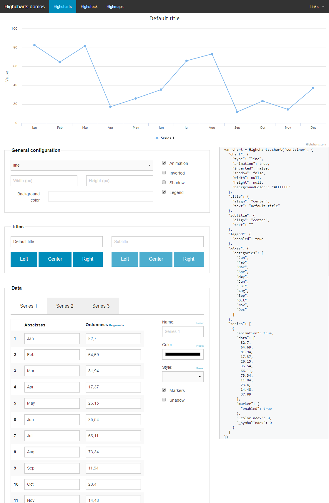

This demo application is designed to show the power of angular and highcharts combined. 
By adjusting parameters, both graph and json configuration object are updated in live !
Just enjoy having dynamic and reactive graphs !

**Here is a live demo:**  https://yllieth.github.io/demo-angular-highcharts/app/index.html

    <h4>Angular 1.5.0</h4>

    <h4>Highcharts 1.5.0</h4>

    <h4>Zurb foundation 6.2</h4>

    

    

    

